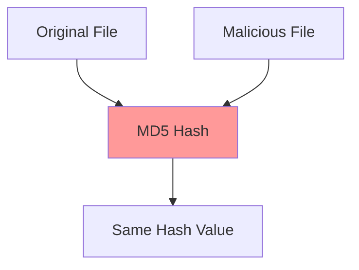

# Hash Collisions: Understanding the Fundamentals

## What is a Hash Collision?

A hash collision occurs when two different inputs produce the same hash output when processed through a hash function. Due to the pigeonhole principle (where we're mapping an infinite input space to a finite output space), collisions are mathematically inevitable - the question is not if they exist, but how hard they are to find.

```text
Example:
Input1: "hello world"      → Hash: a123
Input2: "totally different" → Hash: a123 (Collision!)
```

## Types of Collisions

### 1. Generic Collisions
- **Definition**: Finding any two different inputs that hash to the same value
- **Example**:
```python
hash("mouse") == hash("house")  # A generic collision
```

### 2. Chosen-prefix Collisions
- **Definition**: Finding collisions between two inputs with predetermined prefixes
- **Example**:
```text
Prefix1 + Suffix1 = "Hello " + "abc123" → Hash: xyz789
Prefix2 + Suffix2 = "Goodbye " + "def456" → Hash: xyz789
```

## The Birthday Attack

### Understanding the Birthday Paradox
The birthday attack is named after the birthday paradox, which shows that in a room of just 23 people, there's a >50% chance that two people share a birthday.

### Mathematical Foundation
```
P(collision) ≈ 1 - e^(-n²/2m)
where:
n = number of attempts
m = size of hash output space
```

### Practical Example
For a 256-bit hash:
- Brute force collision: 2²⁵⁶ attempts
- Birthday attack: 2¹²⁸ attempts (square root of brute force)

## Real-World Collision Attacks

### MD5 Collisions


Notable examples:
1. 2004: Wang et al. first MD5 collision
2. 2008: SSL certificate collision
3. 2012: Flame malware using MD5 collision

### SHA-1 Collisions
- 2017: SHAttered attack
- 2020: SHA-1 chosen-prefix collision
- Impact on Git version control system

## Collision Resistance Levels

### Strong Collision Resistance
- Cannot find any two messages that hash to same value
- Computational complexity: O(2^n/2)
- Example: SHA-256 maintains strong collision resistance

### Weak Collision Resistance
- Given message M1, cannot find M2 that hashes to same value
- Computational complexity: O(2^n)
- Also known as second-preimage resistance

## Prevention and Mitigation

### Design Principles
1. Use cryptographically secure hash functions
2. Implement proper input validation
3. Use sufficient hash output length
4. Regular security updates

### Best Practices
```python
# Bad practice (MD5 - vulnerable to collisions)
def bad_hash(data):
    import hashlib
    return hashlib.md5(data).hexdigest()

# Good practice (SHA-256 - collision resistant)
def good_hash(data):
    import hashlib
    return hashlib.sha256(data).hexdigest()
```

## Practical Detection Methods

### 1. Statistical Analysis
Monitor hash distribution patterns:
```python
def analyze_hash_distribution(hashes):
    from collections import Counter
    distribution = Counter(hashes)
    return any(count > 1 for count in distribution.values())
```

### 2. Length Extension Detection
```python
def check_length_extension(original_hash, message_length):
    # Implementation of length extension detection
    padded_length = (message_length + 8) & ~63
    return padded_length == len(original_hash)
```

## Impact on Different Applications

### 1. Digital Signatures
- Collision attacks can create fraudulent signatures
- Mitigation: Use strong hash functions (SHA-256 or better)

### 2. Password Storage
- Rainbow table attacks exploit collisions
- Mitigation: Salt passwords before hashing

### 3. Content Addressing
- File deduplication systems vulnerable to collisions
- Mitigation: Use multiple hash functions

## Testing for Collisions

### Simple Collision Test
```python
def test_for_collision(hash_function, input1, input2):
    """
    Test if two inputs create a hash collision
    """
    hash1 = hash_function(input1)
    hash2 = hash_function(input2)
    
    if hash1 == hash2 and input1 != input2:
        return True, hash1
    return False, None
```

### Advanced Detection
```python
def detect_potential_attacks(hash_values, threshold=0.01):
    """
    Detect suspicious patterns in hash distributions
    """
    total_hashes = len(hash_values)
    unique_hashes = len(set(hash_values))
    
    collision_rate = (total_hashes - unique_hashes) / total_hashes
    return collision_rate > threshold
```

## Future Considerations

### Quantum Computing Impact
- Grover's algorithm affects collision resistance
- Need for quantum-resistant hash functions
- Post-quantum cryptography considerations

### Emerging Mitigations
1. Multi-hash approaches
2. Dynamic hash function selection
3. Blockchain-inspired verification

## Conclusion

Hash collisions are an inherent mathematical property of hash functions. While they cannot be eliminated, understanding their nature and implementing proper mitigations can protect systems from practical attacks. Key takeaways:

1. Use cryptographically secure hash functions
2. Understand birthday attack implications
3. Implement proper detection mechanisms
4. Stay updated with latest vulnerabilities
5. Plan for quantum computing era

## Additional Resources

1. Research Papers
   - "How to choose a cryptographic hash function"
   - "Birthday attacks in practice"
   - "Quantum impacts on hash collision resistance"

2. Tools
   - HashCollider: Testing tool for collision resistance
   - HashDetective: Collision detection framework
   - CryptoAnalyzer: Hash function analysis suite