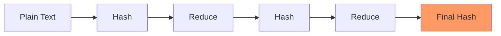

# Rainbow Tables: Advanced Password Cracking

## Understanding Rainbow Tables

### What are Rainbow Tables?
Rainbow tables are precomputed tables of password hashes used to crack password hashes through space-time trade-off. Unlike brute-force attacks, rainbow tables trade storage space for dramatic improvements in cracking speed.

### Basic Concepts


Key Components:
1. **Reduction Function**: Converts hash back to possible plaintext
2. **Chain**: Series of alternating hash and reduction operations
3. **Start Point**: Initial plaintext value
4. **End Point**: Final hash value stored in table

## Rainbow Table Structure

### Chain Generation
```python
def generate_chain(start_plain, chain_length, hash_func, reduce_func):
    """
    Generate a single rainbow table chain
    """
    current = start_plain
    
    for i in range(chain_length):
        # Hash the current plaintext
        hashed = hash_func(current)
        # Reduce the hash to new plaintext
        current = reduce_func(hashed, i)
    
    return (start_plain, current)  # Store start and end points
```

### Table Generation
```python
def generate_rainbow_table(size, chain_length, hash_func, reduce_func):
    """
    Generate a complete rainbow table
    """
    table = {}
    
    for i in range(size):
        start_plain = generate_random_plain()
        start, end = generate_chain(start_plain, chain_length, 
                                  hash_func, reduce_func)
        table[end] = start
    
    return table
```

## Implementation Details

### 1. Reduction Functions
```python
def reduction_function(hash_value, column):
    """
    Convert hash value back to possible plaintext
    """
    # Convert hash to integer
    num = int.from_bytes(hash_value, 'big')
    
    # Apply column-specific modification
    num = (num + column) % password_space_size
    
    # Convert to plaintext format
    return convert_to_password_chars(num)
```

### 2. Chain Merging and Storage
```python
class RainbowTable:
    def __init__(self):
        self.chains = {}
        self.metadata = {
            'chain_length': 0,
            'table_size': 0,
            'hash_function': '',
            'charset': ''
        }
    
    def add_chain(self, end_hash, start_plain):
        self.chains[end_hash] = start_plain
        self.metadata['table_size'] += 1
```

### 3. Lookup Process
```python
def crack_hash(rainbow_table, target_hash, chain_length, 
               hash_func, reduce_func):
    """
    Attempt to crack a password hash using rainbow table
    """
    for i in range(chain_length - 1, -1, -1):
        current = target_hash
        
        # Generate chain from position i
        for j in range(i, chain_length - 1):
            current = reduce_func(current, j)
            current = hash_func(current)
            
        # Check if end point exists in table
        if current in rainbow_table:
            # Regenerate chain from start to find match
            candidate = regenerate_chain(
                rainbow_table[current], 
                target_hash,
                i
            )
            if candidate:
                return candidate
                
    return None
```

## Optimization Techniques

### 1. Perfect Rainbow Tables
- Eliminate chain collisions
- Optimize chain length
- Balance coverage vs. size

```python
def optimize_chain_length(password_space, success_rate):
    """
    Calculate optimal chain length for given parameters
    """
    m = int(math.sqrt(password_space))  # table size
    t = int(math.sqrt(password_space))  # chain length
    
    while success_probability(m, t) < success_rate:
        t += 1
        m = password_space // t
    
    return t, m
```

### 2. GPU Acceleration
```python
from numba import cuda

@cuda.jit
def gpu_chain_generation(start_points, chain_length, table):
    """
    Generate rainbow chains using GPU acceleration
    """
    idx = cuda.grid(1)
    if idx < start_points.size:
        current = start_points[idx]
        for i in range(chain_length):
            current = hash_and_reduce(current, i)
        table[idx] = current
```

## Countermeasures

### 1. Salting
```python
def secure_hash_with_salt(password):
    """
    Properly salt and hash a password
    """
    salt = os.urandom(16)
    return {
        'salt': salt,
        'hash': hashlib.pbkdf2_hmac(
            'sha256',
            password.encode(),
            salt,
            100000  # iterations
        )
    }
```

### 2. Key Stretching
```python
def key_stretching(password, iterations=100000):
    """
    Implement key stretching
    """
    result = password.encode()
    for _ in range(iterations):
        result = hashlib.sha256(result).digest()
    return result
```

### 3. Memory-Hard Functions
Example using Argon2:
```python
from argon2 import PasswordHasher

def secure_password_hash(password):
    ph = PasswordHasher(
        time_cost=2,      # iterations
        memory_cost=65536, # memory usage
        parallelism=4     # threads
    )
    return ph.hash(password)
```

## Storage Considerations

### 1. Disk Organization
```python
class RainbowTableStorage:
    def __init__(self, filename):
        self.filename = filename
        
    def save_chain(self, end_hash, start_plain):
        """
        Save chain to disk with efficient indexing
        """
        with open(self.filename, 'ab') as f:
            pickle.dump((end_hash, start_plain), f)
```

### 2. Compression Techniques
```python
def compress_chain(start_point, end_point):
    """
    Compress rainbow chain for storage
    """
    # Convert to binary format
    binary_data = pack_chain_data(start_point, end_point)
    
    # Apply compression
    return zlib.compress(binary_data)
```

## Performance Analysis

### Time Complexity
- Table Generation: O(m × t)
- Lookup: O(t²)
where:
- m = number of chains
- t = chain length

### Space Complexity
- Storage: O(m × (log(N) + log(N)))
where:
- N = password space size
- m = number of chains

## Security Implications

### 1. Coverage Analysis
```python
def calculate_coverage(table_size, chain_length, password_space):
    """
    Calculate theoretical coverage of password space
    """
    unique_entries = table_size * chain_length
    return (unique_entries / password_space) * 100
```

### 2. Success Probability
```python
def success_probability(table_size, chain_length, password_space):
    """
    Calculate probability of successful crack
    """
    coverage = calculate_coverage(table_size, chain_length, 
                                password_space)
    return 1 - math.exp(-coverage)
```

## Best Practices

### For Defenders
1. Always use salting
2. Implement proper key stretching
3. Use memory-hard functions
4. Regular security audits
5. Monitor for cracking attempts

### For Researchers
1. Study new optimization techniques
2. Develop improved countermeasures
3. Analyze quantum impacts
4. Document attack patterns

## Conclusion

Rainbow tables represent a sophisticated approach to password cracking that demonstrates the importance of proper password hashing techniques. Key takeaways:

1. Always implement proper salting
2. Use modern hashing algorithms
3. Consider memory-hard functions
4. Regular security assessments

## Additional Resources

### Tools
1. RainbowCrack
2. Ophcrack
3. HashCat

### Research Papers
1. "Original Rainbow Table Paper"
2. "Modern Optimization Techniques"
3. "Cryptanalysis of Rainbow Tables"