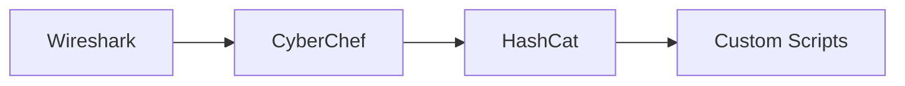

# 🛠️ Cryptographic Tools and Software

## 🔍 Analysis Tools

### CyberChef - The Cyber Swiss Army Knife
**What It Does:** Web-based encoding/decoding/analysis/conversion tool
```bash
# Common CyberChef "recipes":
Base64 > XOR > ROT13
Magic Function for auto-detection
String manipulation and analysis
```
🔥 **Pro Tip:** Save your favorite recipes for quick access!

### Ghidra
**What It Does:** Software reverse engineering framework
```bash
# Basic Usage:
ghidra_9.X/ghidraRun
New Project > Import Binary > Analyze
```
🎓 **Learning Resources:** NSA's official Ghidra course materials

### IDA Pro/Free
**What It Does:** Interactive disassembler for binary analysis
- Powerful debugging capabilities
- Multi-platform support
- Extensible with plugins
- Python scripting support

## 🌐 Network Security

### Wireshark
**What It Does:** Network protocol analyzer
```bash
# Useful capture filters:
tcp port 443
host 192.168.1.1
!(arp or dns)
```
🔐 **Security Tip:** Always capture on a secure network you own!

### Burp Suite
**Features:**
- Proxy intercepting
- Scanner
- Repeater
- Intruder
- Decoder
- Comparer

## 🔓 Code Breaking

### HashCat
```bash
# Common attack modes:
hashcat -a 0 -m 0 hash.txt wordlist.txt        # Dictionary
hashcat -a 3 -m 0 hash.txt ?a?a?a?a?a?a        # Brute force
hashcat -a 1 -m 0 hash.txt wordlist1.txt wordlist2.txt  # Combinator
```

### John the Ripper
```bash
# Basic usage:
john --wordlist=passwords.txt --format=raw-md5 hashes.txt
john --show --format=raw-md5 hashes.txt
```

## 🔒 Encryption Tools

### GPG (GNU Privacy Guard)
```bash
# Key management:
gpg --gen-key                     # Generate new key pair
gpg --encrypt --recipient user@example.com file.txt
gpg --decrypt file.txt.gpg
```

### VeraCrypt
- Create encrypted containers
- Full disk encryption
- Hidden volumes
- Plausible deniability

## 🔬 Forensics

### Autopsy
**Features:**
- Timeline analysis
- File recovery
- Keyword search
- Hash filtering
- Registry analysis

### Volatility
```bash
# Memory analysis:
volatility -f memory.dump imageinfo
volatility -f memory.dump --profile=Win10x64 pslist
volatility -f memory.dump --profile=Win10x64 filescan
```

## 🎯 CTF Specific

### PwnTools (Python)
```python
from pwn import *

# Connect to service
conn = remote('challenge.com', 1337)

# Send/receive data
conn.send('payload')
response = conn.recv()

# Pattern creation
pattern = cyclic(100)
```

### RsaCtfTool
```bash
# Basic usage:
python3 RsaCtfTool.py --publickey key.pub --private
python3 RsaCtfTool.py --attack fermat --n [modulus]
```

## 💻 Development Tools

### OpenSSL CLI
```bash
# Generate certificates:
openssl req -x509 -newkey rsa:4096 -keyout key.pem -out cert.pem -days 365

# View certificate info:
openssl x509 -in cert.pem -text

# Generate random bytes:
openssl rand -hex 32
```

### Key Generation Tools
```bash
# SSH Key Generation:
ssh-keygen -t ed25519 -C "your_email@example.com"

# GPG Key Generation:
gpg --full-generate-key
```

## 📱 Mobile Security

### Mobile Security Framework (MobSF)
**Features:**
- Static analysis
- Dynamic analysis
- Web API testing
- Malware analysis

### Frida
```javascript
// Basic Frida script
Java.perform(() => {
    const MainActivity = Java.use('com.example.app.MainActivity');
    MainActivity.checkPassword.implementation = function(password) {
        console.log('Password check bypassed');
        return true;
    };
});
```

## 🎓 Learning Resources

### Practice Platforms
- HackTheBox
- TryHackMe
- OverTheWire
- PicoCTF
- CryptoHack

### Online Tools
- CrackStation (Rainbow tables)
- dCode (Cipher tools)
- HashKiller
- JWT.io
- SSL Labs

## 🚀 Quick Start Guide

1. **For Beginners:**
   - Start with CyberChef
   - Learn basic command-line tools
   - Practice with CTF platforms

2. **For Intermediate:**
   - Master Wireshark/Burp Suite
   - Learn scripting with PwnTools
   - Experiment with HashCat/John

3. **For Advanced:**
   - Develop custom tools
   - Contribute to open source
   - Automate your workflow

## 🔗 Tool Combinations

### Common Workflows


### Automated Analysis Pipeline
```python
#!/usr/bin/env python3
import subprocess
import sys

def analyze_file(filename):
    # Run multiple tools
    strings = subprocess.check_output(['strings', filename])
    hexdump = subprocess.check_output(['hexdump', '-C', filename])
    
    # Process results
    # Your analysis logic here
```

## 🛡️ Safety and Ethics

### Best Practices
1. Always work in isolated environments
2. Keep tools and systems updated
3. Handle sensitive data appropriately
4. Document your processes
5. Follow responsible disclosure

### Legal Considerations
- Only test systems you own/have permission to test
- Respect privacy and data protection laws
- Keep evidence of authorization
- Document all activities

## 🔄 Regular Updates

Stay current with:
- Tool updates and new releases
- Security advisories
- Community developments
- New attack techniques
- Defense mechanisms

## 🤝 Community Resources

### Forums and Communities
- Reddit (r/netsec, r/crypto)
- Stack Exchange
- GitHub Discussions
- Discord servers
- Local meetups

### Contributing
- Report bugs
- Submit patches
- Share tools
- Write documentation
- Help others learn

Remember: Tools are only as good as the person using them. Keep learning, stay curious, and practice responsibly! 🚀

